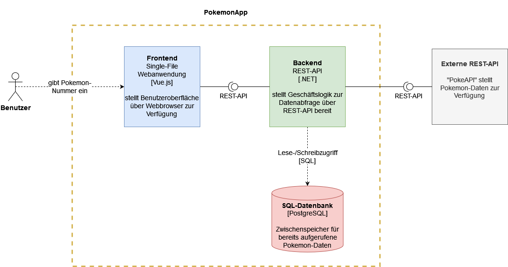
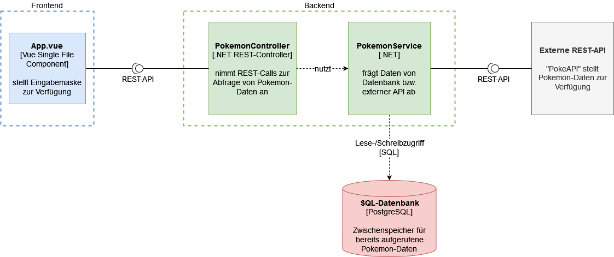

# Projektdokumentation

>Dokumentation zur Projektarbeit im Fach "Software-Qualitätssicherung" an der TH Rosenheim (SoSe23) von Karl Herzog

Der Aufbau dieser Dokumentation orientiert sich am offiziellen [Arc42-Template](https://docs.arc42.org/home/)

## Kapitel 0: Voraussetzungen
Folgende Softwarevoraussetzungen müssen zum lokalen Testen der Anwendung gegegeben sein:
- Node.js in der aktuellen LTS-Version
- .NET 7
- eine laufende PostgreSQL-Instanz

## Kapitel 1: Einleitung
### Fachliche Anforderungen
Die *PokemonApp* soll es dem Nutzer ermöglichen, Basisinformationen zu allen derzeit bekannten Pokemon zu erhalten. Nach Eingabe der individuellen Nummer eines Pokemon werden sein Name, sein Bild in Form eines Sprite sowie sein Typ bzw. Typen (sofern das Pokemon zwei Typen besitzt) angezeigt. Sind die jeweiligen Daten in der angebundenen SQL-Datenbank bereits vorhanden, werden sie direkt über eine entsprechende Datenbankabfrage gewonnen. Ansonsten erfolgt eine HTTP-REST Anfrage über die öffentlich verfügbare [PokeAPI](https://pokeapi.co/). Die erhaltenen Daten werden daraufhin in der Datenbank abgespeichert. Damit soll sichergestellt werden, dass im Falle des Nichtvorhandenseins der API dennoch ein Mindestmaß an positiver User Experience gegeben ist und bereits vorhandene Daten weiterhin abgerufen werden können.
### Qualitätsziele
Die relevanten Qualitätsziele werden in [Kapitel 10](#kapitel-10-qualität) im Details erläutert.
### Stakeholder
Stakeholder des Projekts sind die Studenten sowie der Dozent im Fach "Software-Qualitätssicherung" an der TH Rosenheim.

## Kapitel 2: Beschränkungen
Bekannte, nicht veränderbare Beschränkungen sind die Vorgaben des Dozenten zur Grundstruktur des Projekts. Dieses soll aus folgenden Elementen bestehen:
- Frontend
- Backend
- Datenbank
- Externe REST-API

## Kapitel 3: Kontext und Umfang
Die nachfolgenden Diagramme orientieren sich am sog. [C4 Modell](https://c4model.com/) zur Visualisierung von Softwarearchitektur.
### Kontextdiagramm (Level 1)
Das Kontextdiagramm zeigt die logische Architektur des Systems, seine Abgrenzung nach außen sowie seine Interaktion mit Benutzern und externen Systemen.

### Containerdiagramm (Level 2)
Im Containerdiagramm werden die zentralen Bausteine des Softwaresystems sowie ihre Interaktionen untereinander dargestellt.

### Komponentendiagramm (Level 3)
Das Komponentendigramm zeigt in einer Detailansicht die Komponenten der jeweiligen Container und ihre Beziehungen zueinander.

## Kapitel 4: Lösungsstrategie
### Technische Entscheidungen
Zur Umsetzung der Anwendung wurde folgender Technikstack gewählt:
- Frontend: Vue 3
- Backend: .NET 7
- Datenbank: PostgreSQL
- Externe REST-API: [PokeAPI](https://pokeapi.co/)

Zur Begründung:

Bei **Vue.js** in der Version 3 handelt es sich um ein modernes JavaScript-Framework, welches neben Angular und React eine sehr hohe, weltweite Verbreitung und Populartität genießt und die Vorteile der beiden genannten Frameworks verbindet. Desweiteren zeichnet sich Vue durch eine eher steile Lernkurve und eine hervorragende Benutzerdokumentation aus, was den Einstieg für neue Entwickler erleichtert.

Bei **.NET** handelt es sich um eines der meistverbreitetsten Frameworks für Webentwicklung, welches von einer großen Zahl an Entwicklern beherrscht wird und daher als etablierte Lösung betrachtet werden kann.

**PostgreSQL** ist eine moderne und ebenfalls weitverbreitete SQL-Datenbank, die sich neben Sicherheits-Features auch durch Skalierbarkeit und hohe Flexibilität auszeichnet. Als Datenbanksystem ist es daher das Mittel der Wahl.

**PokeAPI** ist ein laufend gepflegtes, umfangreiches REST-API zum Abruf von Pokemon-Daten. Seine kostenlose Nutzung und der Verzicht auf einen API-Key gestalten die Einbindung in die PokemonApp besonders einfach und performant.

## Kapitel 5: Baustein-Sicht 
Die Bausteinsicht ist aus dem Kontextdiagramm in [Kapitel 3](#kapitel-3-kontext) ersichtlich und bedarf aufgrund der Einfachheit der Anwendung keiner weiteren Erläuterung.

Eine Schnittstellendefinition nach OpenAPI ist nach dem Starten der Anwendung unter [http://localhost:5099/swagger/index.html](http://localhost:5099/swagger/index.html) erreichbar.

## Kapitel 6: Runtime-Sicht
Das Systemverhalten und das Zusammenspiel der Komponenten lässt sich wie folgt beschreiben:

Nach einer Nutzereingabe prüft das Frontend die Eingabe auf eine gültige Pokemon-Nummer. Bei einer falschen Eingabe, die keinen Integerwert darstellt oder die Anzahl der bisher bekannten Pokemon übersteigt, erhält der Nutzer eine Fehlermeldung und der Eingabebutton wird entsprechend deaktiviert, um das Absenden der falschen Anfrage zu verhindern. 

Im Falle einer korrekten Eingabe wird die Nutzeranfrage an den REST-Controller im Backend weitergeleitet. Dieser führt ein Parsing und Prüfung des Wertes durch und leitet diesen dann an den entsprechenden Service weiter.

Der Service prüft das Vorhandensein der Pokemon-Nummer in der PostgreSQL-Datenbank. Ist die Prüfung positiv, gibt der Service die entsprechenden Daten vom Backend zurück an das Frontend, wo die Basisinformationen des Pokemon angezeigt werden.

Ist die angefragte Nummer jedoch nicht in der Datenbank lokal zwischengespeichert, so sendet der Service einen GET-Request an ein externes REST-API, führt danach ein Parsing der erhaltenen Daten durch, speichert diese in der lokalen Datenbank und reicht schließlich die Daten an das Frontend zur Anzeige weiter.

## Kapitel 7: Deployment-Sicht
Als Ausführungsumgebung dient ein Webserver für das Frontend, ein Applikationsserver für das Backend sowie ein Datenbankserver. Aufgrund der Einfachheit der Anwendung können alle Komponenten sowohl in einer eigenen Virtualisierungsumgebung ("On-Premise") als auch containerisiert in der Cloud deployt werden.

Während der Entwicklungs- und Testphase wurde die Anwendung lokal und in der CI-Pipeline laufen gelassen. Für größere und komplexere Anwendungen wäre die Einrichtung verschiedener Umgebungen (Development, Test, Staging, Production) unerlässlich. Im vorliegenden Kontext wurde aber aufgrund der Einfachheit der Anwendung auf solch eine Unterteilung verzichtet.

## Kapitel 8: Querschnittskonzepte

### Sicherheit
Die Sicherheit des Systems wird im Zuge sog. Security-Tests geprüft. Da der Client nur lesenden Zugriff auf das REST-API erhält wird auf weitergehende Authentifizierungsmaßnahmen bewusst verzichtet.

### Internationalisierung
Aufgund der geringen Größe ist die Anwendung durchwegs in englischer Sprache gehalten. Ein Konzept für eine Internationalisierung erscheint erst bei zunehmender Komplexität der Anwendung sinnvoll.

### User Interface
Die Benutzerschnittstelle ist möglichst ergonomisch und einfach verständlich gestaltet, sodass keine großen Hindernisse bei der Bedienung bestehen. Mithilfe des CSS-Frameworks *Bootstrap* erhält die Oberfläche zudem ein modernes und vielen Benutzer vertrautes Erscheinungsbild.

### User Experience
Die verwendete SQL-Datenbank dient als lokaler Zwischenspeicher, sollte die externe REST-API aus Gründen, die der Entwickler nicht zu vertreten hat, temporär nicht erreichbar sein. Damit soll ein Mindestmaß an Benutzbarkeit geschaffen werden, da der Nutzer zumindest solche Daten abfragen kann, die bereits einmal in der Datenbank gespeichert wurden. Mit diesem Schritt soll also eine möglichst positive User Experience sichergestellt werden.

### Interna (Under-the-hood)
Eine Plausibilitätsprüfung bzw. Validierung der Nutzereingabe auf Frontend- und Backend-Ebene wird durchgeführt.

Ein explizites Session Handling erscheint aufgrund des Nutzungskontexts sowie der Größe der Anwendung nicht praktikabel.

Eine Skalierung ist dank des modularen Aufbaus der Anwendung bei Bedarf jederzeit möglich. In diesem Falle sollte auch über die Einführung einer expliziten Lösung für das Monitoring und Logging nachgedacht werden.

Der Bedarf nach einer Administration der Anwendung über eine gesonderte Oberfläche besteht aufgrund des geringen Projektumfanges nicht. Die verwendete PostgreSQL-Datenbank ist jedoch über das integrierte Administrationstool *pgAdmin* verwaltbar.

Eine elaborierte Persistenzstrategie erscheint im vorliegenden Projekt nicht nötig, da die Datenbank hauptsächlich den Zweck eines lokalen Zwischenspeichers erfüllt und keine sensiblen Daten gesichert werden müssen, die eine explizite Backup-Strategie verlangen würden.

## Kapitel 9: Architekturentscheidungen
Die wichtigsten Entscheidungen mit Auswirkungen auf die Architektur werden als sog. *architecture decision records* (ADR) nach dem Nygard-Schema dokumentiert.
|Sektion    |Beschreibung|
|---        |---         |
|Titel   |ADR 1: Architektur-Pattern für Backend   |
|Kontext   | Die Architektur und der Aufbau des Backends ist eine fundamentale Entscheidung vor Entwicklungsbeginn, die über den gesamten Prozess hin bestehen bleiben soll. Die Festlegung auf das bekannte und verbreitete MVC-Pattern stellt nicht nur gängige Praxis dar, sondern ermöglicht neuen Entwicklern eine schnelle Einarbeitung in das Projekt, da sie in der Regel sehr gut mit dem Pattern vertraut sind. |
|Entscheidung   | MVC-Pattern (Model-View-Controller)  |
|Status   | Akzeptiert  |
|Konsequenzen   |  Eine spätere Änderung dieser Entscheidung würde eine komplette Neuentwicklung nötig machen und ist daher unbedingt zu vermeiden.|

|Sektion    |Beschreibung|
|---        |---         |
|Titel   |ADR 2: Build- und Entwicklungsserver für Frontend   |
|Kontext   | Ein schneller Build- und Entwicklungsserver ist für die effiziente Entwicklung des Frontends unerlässlich und sollte an das gewählte JavaScript-Framework (hier: Vue) angepasst werden. Durch die Unterstützung vom ES6-Modulen und dem sog. *Hot Module Replacement* werden Änderungen am Frontend deutlich schneller gerendert und unterstützen den Entwickler daher spürbar. Desweiteren ist Vite zum Paketieren der Anwendung nutzbar, sodass weitere Bibliotheken entfallen.  |
|Entscheidung   | [Vite](https://vitejs.dev/)  |
|Status   | Akzeptiert   |
|Konsequenzen   | Möglicherweise kann sich eine erhöhte Einarbeitungszeit für die Entwickler ergeben, da die gewählte Technik derzeit noch eine geringere Verbreitung als alternative Lösungen hat. |

|Sektion    |Beschreibung|
|---        |---         |
|Titel   | ADR 3: Wahl des Datenbanksystems  |
|Kontext   | Es muss eine geeignete, SQL-basierte Datenbank ausgewählt werden. Da die Datenbank im Projekt hauptsächlich als lokaler Zwischenspeicher dient und relativ geringe Datenmengen anfallen, ist eine SQL-basierte Datenbank vor allem aufgrund ihrer Konsistenz und Datenintegrität (ACID) einer NoSQL-Datenbank in jedem Fall vorzuziehen. |
|Entscheidung   | PostgreSQL  |
|Status   | Akzeptiert  |
|Konsequenzen   | Berücksichtigung der ACID-Eigenschaften (atomicity, consistency, isolation und durability) anstatt BASE  |

|Sektion    |Beschreibung|
|---        |---         |
|Titel   | ADR 4: Kommunikation zwischen Komponenten |
|Kontext   |  Es soll ein einfaches und verbreites Schema für die Kommunikation von Komponenten in verteilten Systemen gewählt werden. Aus pragmatischen Gründen bietet sich REST für den Projektkontext an, da es sich um eines der verbreitetsten Konzepte handelt, das nahezu jeder Entwickler beherrschen dürfte. Eine Wahl von Alternativen wie GraphQL scheint aktuell zu riskant, da nicht automatisch davon ausgegangen werden kann, dass es von neuen Entwicklern beherrscht wird. |
|Entscheidung   |  REST |
|Status   | Akzeptiert  |
|Konsequenzen   | Möglicherweise kann in einigen Jahren die Ablöse von REST zugunsten des zukunftsträchtigen und performanteren GraphQL nötig werden. |

## Kapitel 10: Qualität
### Nicht-funktionale Qualitätsanforderungen nach ISO 25010

#### Sicherheit
- **Benutzereingaben**: Das System soll durch Prüfung der Nutzereingaben auf korrekte Datentypen oder ungültige Pokemon-Nummern Sicherheitsrisiken so gut wie möglich verhindern. (*=> sichergestellt durch Komponenten- und GUI-Tests sowie Security-Tests*)

- **Drittanbieter**: Sicherheitslücken in Frameworks und Biliotheken von Drittanbietern sollen bei jedem Buildvorgang erkannt werden (*=> sichergestellt durch Security-Tests*)

- **Datenschutz**: Die Anwendung muss konform mit den relevanten Datenschutzgesetzen sein und darf keinerlei persönliche Daten verarbeiten. (*=> sichergestellt durch allgemeinen Funktionsumfang sowie teilweise durch GUI-Tests und Security-Tests*)

#### Effizienz und Performanz
- **Leistung und Skalierbarkeit**: Die Anwendung soll im regulären Betrieb Anfragen von 400 Benutzern über einen durchschnittlichen Zeitraum von 5 Minuten und plötzliche Lastanstiege (Peaks) auf bis zu 1400 Benutzer für 2 Minuten verarbeiten können. (*=> sichergestellt durch Last- bzw Spiketests*)

#### Wartbarkeit
- **Testbarkeit**: Die Anwendung soll durch modularen Aufbau zuverlässig testbar sein und eine Testabdeckung von mind. 80% aufweisen. (*=> sichergestellt durch statische Codeanalyse in Sonarcloud und Integration der Test Coverage*)

- **Wartbarkeit und Erweiterbarkeit**: Durch Schnittstellen und modularen Aufbau soll die Wartbarkeit der Anwendung gefördert werden, um diese bestmöglich aktualisieren und erweitern zu können, beispielsweise bei einer Änderung der PokeAPI, der JSON-Struktur der HTTP-Response oder Hinzukommen neuer Pokemon nach dem Erscheinen neuer Spiele. (*=> sichergestellt durch modulare Architektur und Einsatz des MVC-Pattern*)

- **Wirtschaftlichkeit**: Die Kosten für Entwicklung und Betrieb der Anwendung sollen durch ausschließlichen Einsatz von Open-Source-Tools minimiert werden. (*=> sichergestellt durch Wahl des Technik-Stacks*)

#### Benutzbarkeit
- **Benutzerfreundlichkeit**: Das Nutzer-Interface soll ergonomisch gestaltet und selbsterklärend bedienbar sein. Alle Funktionen sollen innerhalb von maximal 2 Klicks erreichbar sein, um eine positive Benutzererfahrung zu bieten. (*=> sichergestellt durch manuelle Tests sowie teilweise durch GUI-Tests*)

#### Kompatibilität
- **Interoperabilität und Integration**: Die verschiedenen Komponenten der Anwendung sollen sich zu einer lauffähigen Anwendung integrieren lassen und mit anderen Systemen und Komponenten durch APIs kommunizieren (*=> sichergestellt durch Integrationstests und modulare Architektur*)

Die weiteren Qualitätseigenschaften *funktionale Eignung*, *Portabilität* und *Zuverlässigkeit* wurden für die gegebenen Projektziele als weniger relevant betrachtet.

## Kapitel 11: Qualitätssichernde Maßnahmen und Tests
Alle Tests sind lokal, aber auch automatisiert in der CI-Pipeline (siehe `.github\workflows\cicd.yml`) ausführbar.
### Unittests (Backend)
- Testframework: xUnit
- Testordner: `/PokemonApp.Tests`
- Kommentare:
 Die Tests in `PokemonServiceTests.cs` und `PokemonControllerTests.cs` gehen über einfach Unittests hinaus und ähneln Integrationstests, da hierbei das Zusammenspiel mehrerer Komponenten getestet wird und mit Mocking-Techniken sowie In-Memory Datenbanken gearbeitet wird.

### Unittests (Frontend)
- Testframework: [vitest](https://vitest.dev/)
- Testdatei: `/PokemonApp/Client/src/App.spec.js`
- Kommentare: Die Unittests für das Frontend prüfen die korrekte Validierung der Benutzereingaben. Dabei werden verschiedene Eingabeszenarien berücksichtigt, wie beispielsweise zu niedrige oder zu hohe Pokemon-Nummern, welche nach aktuellem Stand nicht existieren, sowie ungültige Eingabekombinationen aus Ziffern, Buchstaben und Sonderzeichen.

 ### Integrationstests
- Testframework: xUnit
- Testordner: `/PokemonApp.Tests`
- Kommentare: 
In `PokemonControllerIntegrationTests.cs` wird anhand einer laufenden Anwendung getestet, ob sich erfolgreich REST-Aufrufe gegen die API absetzen lassen. Um auch in der CI-Pipeline lauffähig zu sein, wird ein PostgreSQL-Dockercontainer aufgesetzt und verbunden.

### Statische Codeanalyse
Innerhalb der CI-Pipeline (`.github\workflows\cicd.yml`) wird eine Verbindung zu [Sonarcloud](https://sonarcloud.io/project/overview?id=mr-duke_sqs) hergestellt. Neben der statischen Analyse der Codequalität wird auch die Test-Coverage bestimmt und in Sonarcloud angezeigt. Die wichtigsten Ergebnisse der Sonar-Analyse werden in Form von sog. *Badges* prägnant am Anfang dieser Readme-Datei integriert.

### Security-Tests
Folgende Security-Tests und Maßnahmen wurden durchgeführt:
- Aktivierung des in Github integrierten Service *DependaBot* 
- Integration von [OWASP Dependency Check](https://owasp.org/www-project-dependency-check/) in die CI-Pipeline zur automatischen Analyse von gefährdeten Packages und Dependencies. Der erzeugte Dependency-Check Bericht ist in Github unter `Actions -> Artifacts -> dependency-check-report` am Ende der Übersichtsseite downloadbar. Bedauerlicherweise wird die Integration der Dependency-Check Berichte in Sonarcloud zum aktuellem Stand noch nicht unterstützt (siehe entsprechenden Beitrag auf [Sonarcloud Community](https://community.sonarsource.com/t/support-dependency-checks-for-known-vulnerabilities/5188)).
- Integration von [OWASP ZAP](https://www.zaproxy.org/) in die CI-Pipeline zur Durchführung von sog. *Dynamic Application Security Tests* der REST API. Dem ZAP-Scanner wurde dabei die OpenAPI-Definition der REST API übergeben. Der erzeugte Bericht ist in Github unter `Actions -> Artifacts -> zap_scan` am Ende der Übersichtsseite downloadbar.

### GUI-Tests
- Testframework: [Cypress](https://www.cypress.io/)
- Testdatei: `/PokemonApp/Client/src/App.cy.js`
- Kommentare:
Es werden die häufigsten Szenarien und Nutzereingaben (auch Falscheingaben) mithilfe von Oberflächentests geprüft. In der CI-Pipeline werden die Tests im Headless-Modus ausgeführt.

### Lasttests
- Testframework: [k6](https://k6.io/)
- Testordner: `/PokemonApp.Tests/PerformanceTests`
- Folgende Lasttest-Typen wurden erstellt:
    - *Load-Test*: Systemverhalten unter normaler, zu erwartender Last.
    - *Stress-Test*: Systemverhalten bei Überschreitung der normalen Last. Das System kann dabei an seine Grenzen kommen.
    - *Spike-Test*: Systemverhalten bei plötzlichem, massivem Anstieg der Zugriffe.
    - *Soak-Test*: Systemverhalten und -verlässlichkeit über einen längeren Zeitraum hinweg.
- Kommentare: Alle Tests wurden in die CI-Pipline integriert. Da Stress, Spike und v.a. Soak-Tests sehr zeitaufwendig sein können, wurden diese in der Konfigurationsdatei (`.github\workflows\cicd.yml`) bewusst auskommentiert. Bei Bedarf können diese jedoch jederzeit ausgeführt werden. Um die Laufzeiten der CI-Pipeline im Zuge dieses Projektes nicht unnötig in die Länge zu ziehen, wurden außerdem die Zeitintervalle für den Load-Test (`LoadTest.js`) absichtlich verkürzt und hypothetische Nutzerzahlen angenommen. Für authentische Ergebnisse in einem "echten" Anwendunsgszenario sollten Zeitfenster und Anzahl der Nutzer selbstverständlich erhöht werden.
