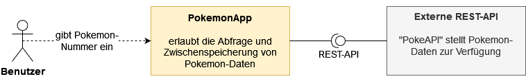
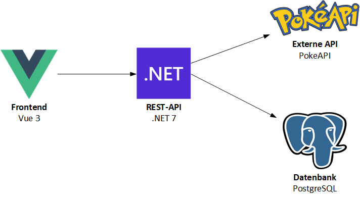

# Projektdokumentation

>Dokumentation zur Projektarbeit im Fach "Software-Qualitätssicherung" an der TH Rosenheim (SoSe23) von Karl Herzog

Der Aufbau dieser Dokumentation orientiert sich am offiziellen [Arc42-Template](https://docs.arc42.org/home/)

## Kapitel 0: Voraussetzungen
Folgende Softwarevoraussetzungen müssen zum lokalen Testen der Anwendung gegegeben sein:
- Node.js in der aktuellen LTS-Version
- .NET 7
- eine laufende PostgreSQL-Instanz

## Kapitel 1: Einleitung
### Fachliche Anforderungen
Die *PokemonApp* soll es dem Nutzer ermöglichen, Basisinformationen zu allen derzeit bekannten Pokemon zu erhalten. Nach Eingabe der individuellen Nummer eines Pokemon werden sein Name, sein Bild in Form eines Sprite sowie sein Typ bzw. Typen (sofern das Pokemon zwei Typen besitzt) angezeigt. Sind die entsprechenden Daten in der angebundenen SQL-Datenbank bereits vorhanden, werden sie direkt über eine Datenbankabfrage gewonnen. Ansonsten erfolgt eine HTTP-ReST Anfrage über die öffentlich verfügbare [PokeAPI](https://pokeapi.co/) und die erhaltenen Daten in der Datenbank abgespeichert. Dadurch soll sichergestellt werden, dass im Falle des Nichtvorhandenseins der API dennoch ein Mindestmaß an positiver User Experience gegeben ist und bereits vorhandene Daten weiterhin abgerufen werden können.
### Qualitätsziele
Die relevanten Qualitätsziele werden in [Kapitel 10](#kapitel-10-qualität) im Details erläutert.
### Stakeholder
Stakeholder des Projekts sind die Studenten sowie der Dozent im Fach "Software-Qualitätssicherung" an der TH Rosenheim.

## Kapitel 2: Beschränkungen
Bekannte, nicht veränderbare Beschränkungen sind die Vorgaben des Dozenten zur Grundstruktur des Projekts. Dieses soll aus folgenden Elementen bestehen:
- Frontend
- Backend
- Datenbank
- Externe REST-API

## Kapitel 3: Kontext
Das Kontextdiagramm zeigt die logische Architektur des Systems, seine Abgrenzung nach Außen sowie seine Interaktion mit Benutzern und externen Systemen.

## Kapitel 4: Lösungsstrategie
### Technische Entscheidungen
Zur Umsetzung der Anwendung wurde folgender Technikstack gewählt:
- Frontend: Vue 3
- Backend: .NET 7
- Datenbank: PostgreSQL
- Externe REST-API: [PokeAPI](https://pokeapi.co/)

Zur Begründung:

Bei **Vue.js** in der Version 3 handelt es sich um ein modernes JavaScript-Framework, welches neben Angular und React sehr hohe, weltweite Verbreitung und Populartität genießt und die Vorteile der beiden genannten Frameworks optimal verbindet. Desweiteren zeichnet sich Vue durch eine eher flache Lernkurve und eien hervorragende Dokumentation aus, was den Einstieg für neue Entwickler erleichtert.

Bei **.NET** handelt es sich um eines der meistverbreitetsten Frameworks für Anwendungsentwicklung, das sich etabliert hat und von den meisten Entwicklenr beherrscht wird.

**PostgreSQL** ist eine modernes und ebenfalls weitverbreitetes SQL-Datenbank, die sich neben Sicherheits-Features auch durch Skalierbarkeit und hohe Flexibilität. Als Datenbanksystem ist es daher das Mittel der Wahl.

**PokeAPI** ist ein hervoragend gepflegtes, umfangreiches REST-API zum Abruf von Pokemon-Daten. Seine kostenlose Nutzung und der Verzicht auf einen API-Key gestlten die Einbindung in die PokemonApp besonders einfach und performant.

### Qualitätsentscheidungen
Die festgelegten Qualitätsziele für die PokemonApp werden in [Kapitel 10](#kapitel-10-qualität) näher ausgeführt.

## Kapitel 5: Baustein-Sicht 
Die Bausteinsicht ist bereits aus dem Kontextdiagramm in [Kapitel 3](#kapitel-3-kontext) ersichtlich und bedarf aufgrund der Einfachheit der Anwendung keiner weiteren Erläuterung.

Eine Schnittstellendefinition ist nach dem Starten der Anwendung unter [http://localhost:5099/swagger/index.html](http://localhost:5099/swagger/index.html) erreichbar.

## Kapitel 6: Runtime-Sicht
Das Systemverhalten und das Zusammenspiel der Komponenten lässt sich wie folgt beschreiben:

Nach einer Nutzereingabe prüft das Frontend die Eingabe auf eine gültige Pokemon-Nummer. Bei einer falschen Eingabe, die keinen Integerwert darstellt oder die Anzahl der bisher bekannten Pokemon übersteigt, erhält der Nutzer eien Fehlermeldung und der Eingabebutton wird entsprechend deaktiviert, um das Absenden der falschen Anfrage zu verhindern. 

Im Falle einer korrekten Eingabe wird die Nutzeranfrage an den REST-Controller im Backend weitergeleitet. Dieser führt ein Parsing und Prüfung des Wertes durch und leitet diesen dann an den entsprenen Service weiter.

Der Service prüft das Vorhandensein der Pokemon-nummer in der verknüpften SQL-Datenbank. Ist die Prüfung positiv, so gibt der Service die entsprechenden Daten vom Backend zurück an das Frontend, wo die Basisinformationen des jeweiligen Pokemon angezeigt werden.

Ist die angefragte Nummer jedoch nicht in der Datenbank lokal zwischengespeichert, so führt der Service einen GET-Request an ein externes REST-API aus, führt danach ein Parsing der erhaltenen Daten durch, speichert diese in der lokalen Datenbank und reicht schließlich die Daten an das Frontend zur Anzeige weiter.

## Kapitel 7: Deployment-Sicht
Als Ausführungsumgebung dient ein Webserver für das Front, ein Applikationsserver für das Backend und ein Datenbankserver. Aufgrund der Einfachheit der Anwendung können alle Komponenten sowohl in einer eignen virtualisierungsumgebung (On-Premise) deployt werden als auch containerisiert in der Cloud.

Während der Entwicklungs- und Testphase wurde die Anwendung lokal deployt und laufen gelassen. Für größere, komplexere Anwendungen ist die Einrichtung verschiedener Umgebungen (Development, Test, Staging, Production) unerlässlich. Im Kontext dieses Projekt wurde aber aufgrund der Einfachheit der Anwendung auf solch eine Unterteilung verzichtet.

## Kapitel 8: Querschnittskonzepte

### Sicherheit
Die Sicherheit des Systems wird im Zuge sog. Security-Tests geprüft. Da der Client nur lesenden Zugriff auf das REST-API erhält wird auf weitergehnde Authentifizierungsmaßnahmen bewusst verzichtet

### Internationalisierung
Aufgund der geringen Größe ist die Anwendung durchwegs in englischer Sprache gehalten. Ein Konzept für eine Internationalisierung erscheint erst bei zunehmender Komplexität der Anwendung sinnvoll.

### User Interface
Die Benutzerschnittstelle ist möglichst ergonomisch und einfach verständlich gestaltet, sodass keine großen Hindernisse bei der Bedienungbestehen. Mithilfe des CSS-Frameworks Bootstrap erhält die Oberfläche ein modernes und vielen Benutzer vertrautes Erscheinungsbild.

### User Experience
Die verwendete SQL-Datenbank dient als lokaler Zwischenspeicher, sollte die externe REST-API aus Gründen, die der Entwickler nicht zu vertreten hat, temporär nicht erreichbar sein. Damit soll ein Mindestmaß an Benutzbarkeit geschaffen werden, da der Nutzer wenigstens solche Daten abfragen kann, die bereits einmal in der Datenbank gespeichert wurden. Mit diesem Schritt soll also eine möglichst positive User Experience sichergestellt werden.

### Interna (Under-the-hood)
Eine Plausibilitätsprüfung bzw. Validierung der Nutzereingabe auf Frontend- und Backend-Ebene wird durchgeführt.

Ein explizites Session Handling erscheint aufgrund des Nutzungskontexts sowie Größe der Anwendung nicht praktikabel.

Eine Skalierung ist aufgrund des modularen Aufbaus der Anwendung bei Bedarf und stiegender Komplexität jederzeit möglich. In diesem Falle sollte auch über die Einführung einer expliziten Lösung für das Monitoring bzw. Logging nachgedacht werden.

Der Bedarf nach einer Administration der Anwendung über eine gesonderte Oberfläche besteht aufgrund des geringen Projektumfanges nicht. Die verwendete PostgreSQL-Datenbank ist jedoch über das integrierte Administrationstool *pgAdmin* verwaltbar.

Eine elaborierte Persistenzstrategie erscheint in diesem Projekt nicht nötig, da die Datenbank hauptsächlich den Zweck eines lokalen Zwischenspeichers erfüllt und keine sensiblen Daten gesichert werden müssen, welche eine explizite Backup-Strategie verlangen würden.

## Kapitel 9: Architekturentscheidungen
Die wichtigsten Entscheidungen mit Auswirkungen auf die Architektur werden als sog. *Architecture decision records* (ADR) nach dem Nygard-Schema dokumentiert.
|Sektion    |Beschreibung|
|---        |---         |
|Titel   |ADR 1: Architektur-Pattern für Backend   |
|Kontext   | Die Architektur und der Aufbau des Backends ist die fundamentale Entscheidung vor Entwicklungsbeginn, die über den gesamten Prozess hin bestehen bleiben soll  |
|Entscheidung   | MVC-Pattern (Model-View-Controller)  |
|Status   | Akzeptiert  |
|Konsequenzen   | Die Festlegung auf das bekannte und verbreitete MVC-Pattern stellt nicht nur gängige Praxis dar, sondern ermöglicht neuen Entwicklern, die damit in der Regel sehr gut vertrat sind, eine schnelle Einarbeitung in das Projekt. Eine spätere Änderung dieser Entscheidung würde womöglich eine komplette Neuentwicklung nötig machen und ist daher unbedingt zu vermeiden.|

|Sektion    |Beschreibung|
|---        |---         |
|Titel   |ADR 2: Build- und Entwicklungsserver für Frontend   |
|Kontext   | Ein schneller Build- und Entwicklungsserver ist für die effiziente Entwicklung des Frontends unerlässlich und sollte an das gewählte JavaScript-Framework (hier: Vue) angepasst werden   |
|Entscheidung   | [Vite](https://vitejs.dev/)  |
|Status   | Akzeptiert   |
|Konsequenzen   | Durch die Unterstützung vom ES6-Modulen und dem sog. *Hot Module Replacement* werden Änderungen am Frontend deutlich schneller gerendert und unterstützen den Entwickler daher spürbar. Desweiteren ist Vite zum Paketieren der Anwendung nutzbar, sodass weitere Bibliotheken entfallen |

|Sektion    |Beschreibung|
|---        |---         |
|Titel   | ADR 3: Datenbank-Typ  |
|Kontext   | Es muss eine Wahl zwischen SQL-basierten und NoSQL-basierten Datenbanken getroffen werden  |
|Entscheidung   | SQL-basiertes Datenbanksystem  |
|Status   | Akzeptiert  |
|Konsequenzen   | Da die Datenbank im Projekt hauptsächlich als lokaler Zwischenspeicher dient und relativ geringe Datenmengen anfallen, ist eine SQL-basierte Datenbank vor allem aufgrund ihrer Konsistenz und Datenintegrität (ACID) einer NoSQL-Datenbank in jedem Fall vorzuziehen  |

|Sektion    |Beschreibung|
|---        |---         |
|Titel   | ADR 4: Kommunikation zwischen Komponenten |
|Kontext   |  Es soll ein einfaches und verbreites Schema für die Kommunikation von Komponenten in verteilten Systemen gewählt werden.  |
|Entscheidung   |  REST |
|Status   | Akzeptiert  |
|Konsequenzen   | Aus pragmatischen Gründen bietet sich REST für den Projektkontext an, da es sich um eines der verbreitetsten Konzepte handelt, das nahezu jeder Entwickler beherrschen dürfte. Eine Wahl von Alternativen wie GraphQL scheint zu riskant, da nicht automatisch davon ausgegangen werden kann, dass es von neuen Entwicklern beherrscht wird. Außerdem macht die überschaubare Datenmenge, welche von der Abwendung abgefragt wird eine Verwendung von alternativen, (möglicherweise performanteren) Konzepten überflüssig |

## Kapitel 10: Qualität
### Nicht-funktionale Qualitätsanforderungen:
(Arc42, nonfunctional requirements, Qualitätseigenschaften ("-ilities"))

- **Leistung und Skalierbarkeit**: Die Anwendung soll nach Benutzereingaben eine Antwortzeit von durchschnittlich maximal 1 Sekunde einhalten, um eine angemessene Benutzererfahrung zu gewährleisten und Frustration auf Seiten der Nutzer zu verhindern.

- **Sicherheit**: Das System soll durch Prüfung der Nutzereingaben auf korrekte Datentypen oder ungültige Pokemon-NummernSicherheitsrisiken wie SQL-Injection so gut wie möglich verhindern

- **Verfügbarkeit**: Die Anwendung soll eine zuverlässige und hohe Verfügbarkeit von 99% aufweisen, um sicherzustellen, dass sie für Benutzer beinahe jederzeit verfügbar ist.

- **Wartbarkeit und Erweiterbarkeit**: Durch Schnittstellen und modularen Aufbau soll die Wartbarkeit der Anwendung gefördert werden, um diese bestmöglich aktualisieren und erweitern zu können, beispielsweise bei einer Änderung der PokeAPI, der JSON-Struktur des HTTP-Response oder Hinzukommen neuer Pokemon nach dem Erscheinen neuer Spiele. 

- **Testbarkeit**: Die Anwendung soll durch modularen Aufbau zuverlässig testbar sein und eine Testabdeckung von mind. 80% aufweisen.

- **Benutzerfreundlichkeit**: Das Nutzer-Interface soll ergonomisch gestaltet und selbsterklärend bedienbar sein. Alle Funktionen sollen innerhalb von maximal 2 Klicks erreichbar sein, um eine positive Benutzererfahrung zu bieten.

- **Interoperabilität und Integration**: Die Anwendung soll in der Lage sein, mit anderen Systemen und Komponenten durch APIs und Schnittstellen zu kommunizieren

- **Wirtschaftlichkeit**: Die Kosten für Entwicklung und Betrieb der Anwendung sollen durch ausschließlichen Einsatz von Open-Source-Tools minimiert werden.

- **Konformität**: Die Anwendung muss konform mit den relevanten Datenschutzgesetzen und -vorschriften sein und soll keinerlei persönliche Daten verarbeiten.

## Kapitel 11: Qualitätssichernde Maßnahmen und Tests
### Unittests
- Testframework: xUnit
- Testordner: /PokemonApp.Tests
- Kommentare:
 Die Tests in `PokemonServiceTests.cd` und `PokemonControllerTests` gehen über einfach Unittests hinaus und ähneln Integrationstests, da hierbei das Zusammenspiel mehrerer Komponenten getestet wird und mit Mocking-Techniken und In-Memory Datenbanken gearbeitet wird.

 ### Integrationstests
- Testframework: xUnit
- Testordner: /PokemonApp.Tests
- Kommentare: 
In `PokemonControllerIntegrationTests` wird anhand einer laufenden Anwendung getestet, ob sich erfolgreich REST-Aufrufe gegen die API absetzen lassen. Um auch in der CI-Pipeline lauffähig zu sein, wird ein PostgreSQL-Dockercontainer aufgesetzt und verbunden.

### Statische Codeanalyse
Innerhalb der CI-Pipeline mithilfe von Github Actions (`.github\workflows\cicd.yml`) wird eine Verbindung zu [Sonarcloud](https://sonarcloud.io/project/overview?id=mr-duke_sqs) hergestellt. Neben der statischen Analyse der Codequalität wird auch die Test-Coverage bestimmt und in Sonarcloud angezeigt. Die wichtigsten Ergebnisse der Sonar-Analyse werden in Form von sog. *Badges* prägnant am Anfang dieser Readme-Datei integriert.

### Security-Test
Neben der Aktivierung der Github-Funktionalität DependaBot wird das Drittanbieter-Tool [OWASP Dependency Check](https://owasp.org/www-project-dependency-check/) in die CI-Pipeline zur automatischen Analyse von gefährdeten Packages und Dependencies integriert. Der nach einem CI-Lauf erzeugte Dependency-Check Bericht ist in Github unter `Actions -> Artifacts` am Ende der Übersichtsseite als HTML-Datei downloadbar.

Bedauerlicherweise wird die Integration der Dependency-Check Berichte in Sonarcloud zum aktuellem Stand (noch) nicht unterstützt (siehe entsprechenden Eintrag auf [Sonarcloud Community](https://community.sonarsource.com/t/support-dependency-checks-for-known-vulnerabilities/5188)).

### GUI-Tests
- Testframework: Cypress
- Testordner: /PokemonApp/Client/src/App.cy.js
- Kommentare:
Es werden die häufigsten Szenarien und Nutzereingaben (auch Falscheingaben) per Oberflächentests geprüft. I nder CI-Pipeline werden die Tests im headless-Modus ausgeführt.

## Gewählte Test-Tools
- Unit-Tests: xUnit
- Integrationstests: xUnit oder NUnit
- Akzeptanztests: SpecFlow
- UI-Tests: 
    - Selenium / Selenium WebDriver API / Kombination mit xUnit oder SpecFLow
    - CodedUI
- Lasttest:
    - K6
    - (Apache JMeter)
- Security:
    - OWAP ZAP
    - Dependency Check
    - (Dependa-bot)

## Geplanter Aufbau: (Orientieren am Arc42 - Framework: docs.arc42.org)
- Prerequisites:
    - Node
    - .Net 7
    - PostgreSQL
- Fachlicher Kontext
- Third Party Libraries, Schnittstellen (API-Dokumentation)
- Architekturentscheidungen (evtl. mit Bild)
- Tests
    - Unit Test: JUnit, Mockito
    - Architektur Test: Arch Unit
    - Integration Test: RestAssured, Test Containers, WireMock/Hoverfly
    - E2E + UI Tests: Cypress (+Mocha), Selenium (+Junit), Cucumber(BDD), Geb
    - Last Performance Test: 
        - Test Setup Architecture
            - CI-based    
            - In-Cluster
            - Dedicated
        - Frameworks: K6(!), Gatling, JMeter, Locust
    - Security Tests
        - Statische Analyse 
            - Sonar / Sonarcloud
            - Test Coverage
            - Zero-Violation-Policy
        - DependaBot (Github Action verfügbar)
        - OWASP Dependency Check
        - IaC Security (Terraform, Dockerfile, k8s): Snyk, Aqua
        - ZED Attack Proxy
         

Aufgaben: 
- Recherche zu Testframeworks
- ~~Rudimentäre Github Actions erstellen~~
    - ~~Kompiliert der Code?~~
    - ~~laufen Unittest?~~
- ~~Erste Tests bereits schreiben~~
- Lasttest für die API schreiben
- Security-Test schreiben
    - Dependency Check (per GitHub Action)
    - (evtl. Versionen autmoatisch aktualisieren lassen per Github Action)
    - Mit OWASP ZAP testen
